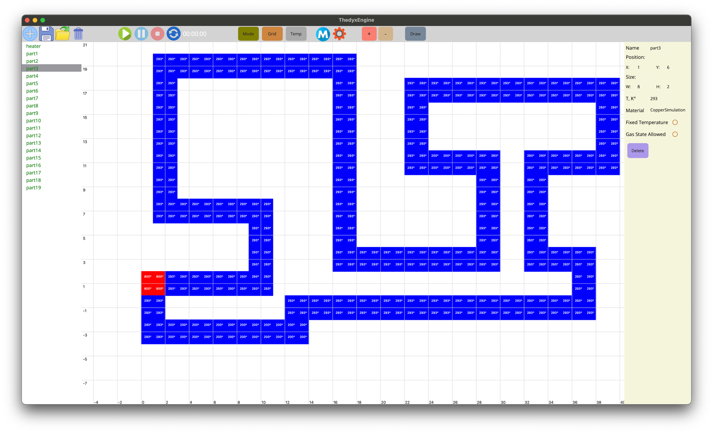
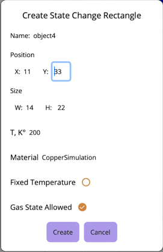
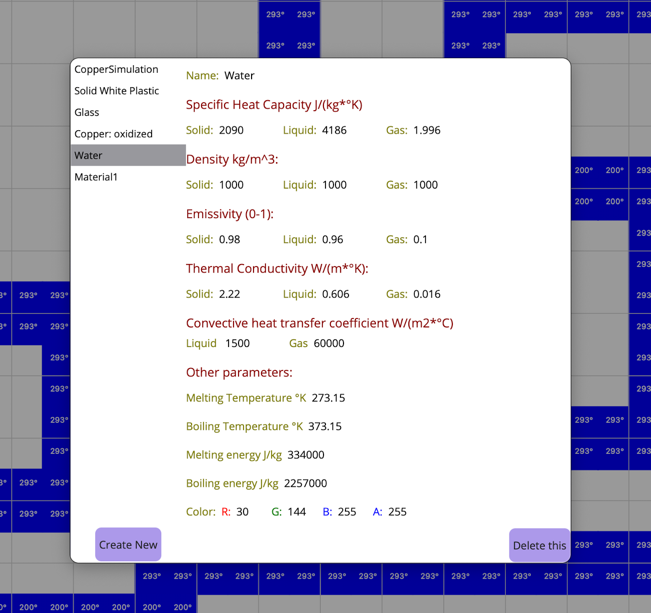
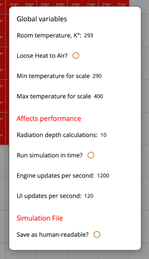

# User Manual for ThedyxEngine
## Brief Overview
ThedyxEngine has rather simple than complex UI, but it allows you to control everything in the application. The UI is divided into four main sections:
1. **Top Bar**: This is where you can find the main menu to Save, Load Files, Start, End simulation, Settings, etc.
2. **Left Tab** This is where you can see the list of the objects in the scene, and you can select them to edit their properties.
3. **Right Tab**: This is where you can see the properties of the selected object, and you can edit them or delete object.
4. **Central canvas**: This is where you can see the simulation and the objects in the scene.

## Adding Objects
You can add objects in two ways:
1) From menu where you can select a type of object and control every detail of created object
2) By drawing it on canvas
### Adding Objects from Menu
1. Click on the **+** button in the top bar on the left 
2. Select the type of object you want to add from the list
3. Fill in the properties of the object in the right tab
4. Click on the **Create** button to add the object to the scene
### Adding Objects by Drawing
1. Click on **Draw** button in the top bar on the left
2. Click first time on the canvas to set the start point of the object
3. Click second time on the canvas to set the end point of the object

## Loading and Saving
You can load and save the scene to a custom format **.tdx**
To load scene: Click on the **Load** button in the top bar and select the file you want to load
To save scene: Click on the **Save** button in the top bar and select to which file you want to save

### Save as human readable
You also can control if you want to be saved simulation file to be human readable or not.
To make it human readable, open a setting menu from top bar and check the **Save as human readable?** checkbox.

## Canvas
### Moving on canvas
You can move on the canvas by dragging your mouse, touchpad or touchscreen.
### Zooming in and out
You can zoom in or out by using pinch to zoom gesture on touchpad or touchscreen.
If you are mouse user, you can use zoom in or zoom out buttons in the top bar on the right.
### Change display mode
Canvas is capable of changing its display mode, there is three buttons to control it in the middle of the top bar:
1. **Mode** button, it allows you to turn on and turn off displaying the temperature in each point of the canvas
2. **Grid** button, it allows you to turn on and turn off displaying the grid on the canvas
3. **Temp** or **Color** button, it allows you to change the display mode. In first mode the color of the object depends on its temperature, in the second mode the color of the object depends on its material for more realistic look. 

## Materials
Each object has a material assigned to it with a physical properties that is needed to be able to calculate all three ways of energy transfers:
1) Solid specific heat capacity kg/m^3
2) Liquid specific heat capacity kg/m^3
3) Gas specific heat capacity kg/m^3
4) Solid emissivity
5) Liquid emissivity
6) Gas emissivity
7) Solid thermal conductivity W/(m × °K)
8) Liquid thermal conductivity W/(m × °K)
9) Gas thermal conductivity W/(m × °K)
10) Melting temperature °K
11) Melting energy J/kg
12) Boiling temperature °K
13) Boiling energy J/kg
14) Liquid convective heat transfer coefficient W/(m^2× °K )
15) Gas convective heat transfer coefficient W/(m^2× °K )

Materials and its properties are parts of the scene, so they are saved with a scene. You can manage materials in the Material menu, which can be opened by clicking on the **M** button in the top bar on the left.

## Controlling simulation
To control simulation, there is four buttons in the top bar:
1) **Start** - starts the simulation
2) **Pause** - pauses the simulation
3) **Stop** - stops the simulation
4) **Reset** - resets the simulation to the initial state

While simulation is running, you cannot change any objects or materials in the scene. You can only change the display mode.

### Controlling simulation speed
There is two ways to run simulation:
1) Default - simulation is going to be run as fast as possible
2) Real time - simulation is going to be run in real time, so you can see how the temperature is changing in real time.
To change it, you need to click **Run dimulation in time** button in the settings menu.

## Controlling objects
You can control objects in the scene by selecting them in the left tab. When you select an object, you can see its properties in the right tab. You can change the properties of the object and delete it from the scene.
Most of the properties are self-explanatory, but there are some properties that need to be explained:
1) Fixed temperature - if this property is checked, the object will not change its temperature during the simulation. This property is useful for objects that are not affected by the simulation, like walls or ground.
2) Gas State Allowed - if this property is checked, the object can change its state to gas during the simulation. This property is useful for objects that can evaporate or boil, like water or ice.

## Important settings
There is a settings menu that can be opened by clicking on the **Settings** button in the top bar. In this menu, you can change the following settings:
1) Room temperature - this is the temperature of the room in which the simulation is running. This temperature is used to calculate the heat transfer between the objects and the room.
2) Loose heat to air checkbox - if this property is checked, the objects will lose heat to the air during the simulation. This property is useful for objects that are in contact with the air, like walls or ground.
3) Min temperature for scale - minimum temperature for colorized temperature scale.
4) Max temperature for scale - maximum temperature for colorized temperature scale.
5) Radiation depth calculations - how deep are we going with ray tracing to calculate radiation.
6) Engine updates per second - very important, affects precision of simulation. The more updates per second, the more precise simulation is, but it takes more time to calculate it. The default value is 60 updates per second.
7) UI updates per second - how often the UI is updated. The default value is 120 updates per second.
8) Save as human readable - if this property is checked, the simulation file will be saved in a human readable format. This property is useful for debugging and testing purposes.

